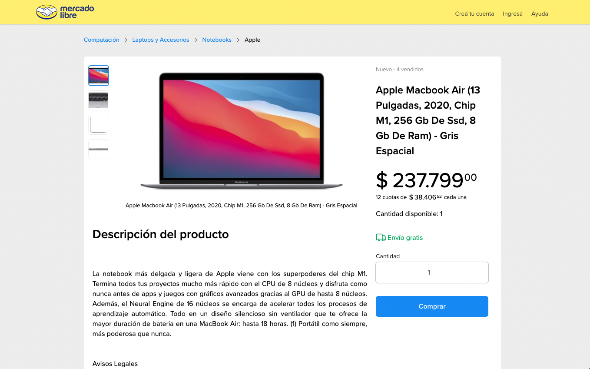

# Ecommerce Team 5 Bootcamp / Wave5

> BRIEF PROJECT DESCRIPTION

## Index

* [1. Walk through and description](#1-Walk-through-and-description)
* [2. Environment setup](#2-Environment-setup)
* [3. Development](#3-Development)
* [4. Debug](#4-Debug)
* [5. Testing](#5-Testing)

## 1. Walk through and description

### Pages
- Home: This page show an search bar and button, here users can find products, not only by name, but also by category. The component we use are:
  - SearchInput

    - 
    - 
    - 

- Products: This page shows a list of products that match what the user searched for on the home page, it also has filters such as: categories, discounts, location, price, products per page and pagination. The component we use are:
  - Filters
  - Breadcrumb
  - SelectProductsPerPage
  - ProductsList
  - Pagination

    - 

- Page Product: Here you can see the product chosen on the previous page with its information:
  Product Images
  Name
  Condition(If it is new or used)
  Quantity Sold
  Quantity Available
  Shipping type
  Price
And it also has a detailed description of the product and its characteristics.
    Required components:
   - ProductAttributes
    -ProductInfo
    -ProductView
    -BreadCrumb

      - 
      - 

- Checkout: This page shows a summary of the product or products that the user is going to buy, showing the number of products, the unit price of the product and the total price of the purchase. The component we use are:
  - Checkout

      - 

- Page error404: It is redirected to this page when trying to enter an invalid address, the message appears along with an image and a button to redirect to the main page
   Required component:
  - Component404   

    - 

## 2. Environment setup

- Install [Node.js](https://nodejs.org/)
  - Recommended method is by using [NVM](https://github.com/creationix/nvm)
  - Recommended Node.js version is the [active LTS](https://github.com/nodejs/LTS#lts-schedule1)
- Update `npm` to the latest version by running `npm i -g npm@latest`
- **While staying connected to VPN**, run `npm install` to install the project dependencies
- For the e2e tests install locally selenium, chromedriver and geckodriver by running `npm run install-selenium`
- Edit your `/etc/hosts` file by adding virtual hosts required for the app running:

_These are just examples, please indicate the real list of domains that is used in project_

```
    127.0.0.1 dev.mercadolibre.com.ar dev.mercadolibre.com.mx dev.mercadolibre.com.co
    127.0.0.1 dev.mercadopago.com.ar
    127.0.0.1 dev.mercadolivre.com.br
    # In case you run the project by `fury run` you should add also these ones
    192.168.99.100 dev.mercadolibre.com.ar dev.mercadolibre.com.mx dev.mercadolibre.com.co
    192.168.99.100 dev.mercadopago.com.ar
    192.168.99.100 dev.mercadolivre.com.br
```

- You may find convenient editing your `.bash_profile` to [auto pick the Node version](https://github.com/mercadolibre/frontend/wiki/Auto-Picking-Node-version) of each project.

## 3. Development

### 1) Run and build the app:

```
npm run dev
```

**Note**: Running this command you will be using React Fast Refresh and Hot Reload Server, [please follow this documentation](https://nordic.adminml.com/docs/fast-refresh) for more information and recommendations of usage.

### 2) Navigate to:

```
https://dev.mercadolibre.com.ar:8443/
https://dev.mercadolibre.com.mx:8443/
https://dev.mercadolibre.com.co:8443/
https://dev.mercadolibre.cl:8443/

```

## 4. Debug

### 1) Build the assets:

```
npm run build
```

_Alternatively you may use the watcher for automatic assets rebuilding: `npm run watch`_

### 2) Run the app with the debug mode:

```
npm run debug
```
## 5. Testing

```
npm run test:unit
```

*poner descripcion de testing*

Coverage 100%
### Files and testers

-Views 

  -Home - Susan Ortiz Muñoz
  -Products - Enrique Chacon Mena
  -Product - Ivan Batista Ochoa
  -Buy - Gabriela Pacheco Abarcia
  -Error404 - Nahuel Occhipinti

- Components

  - BreadCrumb - Enrique Chacon Mena
  - Checkout - Gabriela Pacheco Abarcia
  - Component404 - Nahuel Occhipinti
  - Filter - Enrique Chacon Mena
  - FilterModal - Enrique Chacon Mena
  - FilterApplied - Enrique Chacon Mena
  - FiltersAvailables  - Susan Ortiz Muñoz
  - FilterValue - Emely Vera Villamizar
  - FilterSections - Enrique Chacon Mena
  - InputQuantity - Gabriela Pacheco Abarcia
  - Pagination - Ivan Batista Ochoa
  - ProductAttributes - Ivan Batista Ochoa
  - ProductsCard - Ivan Batista Ochoa
  - ProductInfo - Nahuel Occhipinti
  - ProductInfoBuy - Emely Vera Villamizar
  - ProductView - Emely Vera Villamizar
  - SearchInput - Susan Ortiz Muñoz
  - SelectProductPerPage - Ivan Batista Ochoa
  - ProductSlider - Emely Vera Villamizar
  - ProductsList - Enrique Chacon Mena

- Services

  - ProductService - All

- Middlewares

  - Buy Controller - Emely Vera & Enrique Chacon
  - Product - Ivan Batista & Susan Ortiz
  - Products - Gabriela Pacheco & Nahuel Occhipinti

- Utils

  - priceFormatter - Gabriela Pacheco Abarcia
  - urlGenerator - Enrique Chacon Mena


## Team:

- Enrique Chacon Mena
- Emely Vera Villamizar
- Susan Ortiz Muñoz
- Nahuel Occhipinti
- Gabriela Pacheco Abarcia
- Ivan Batista Ochoa

## License

© 2022 Mercado Libre
